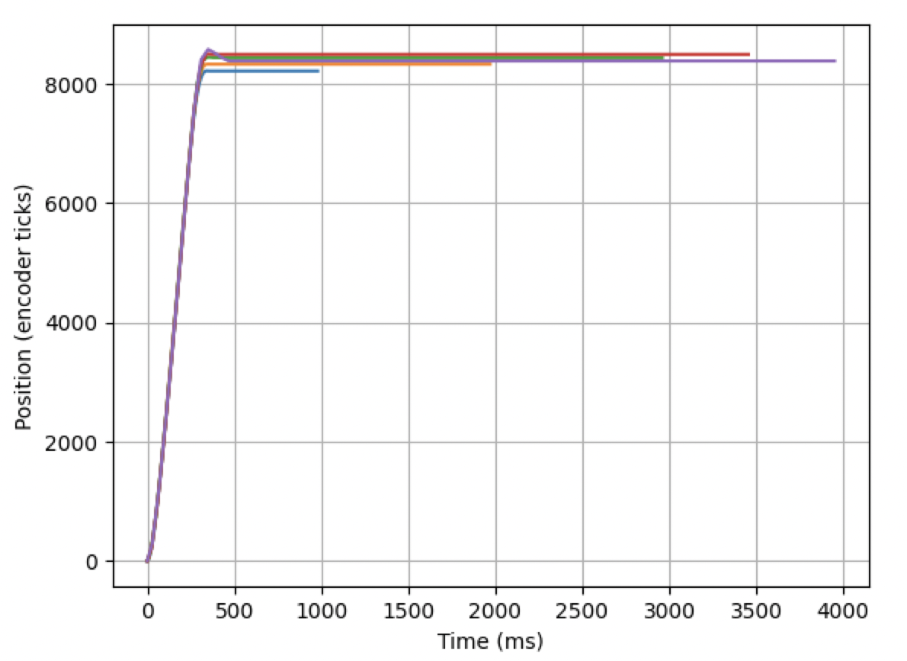
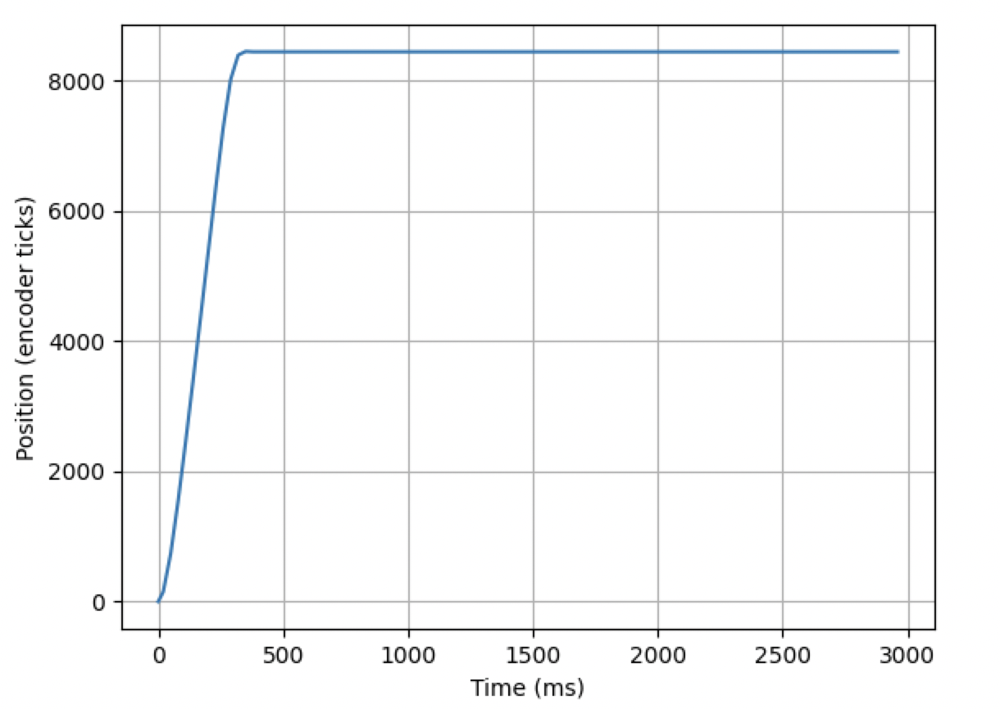
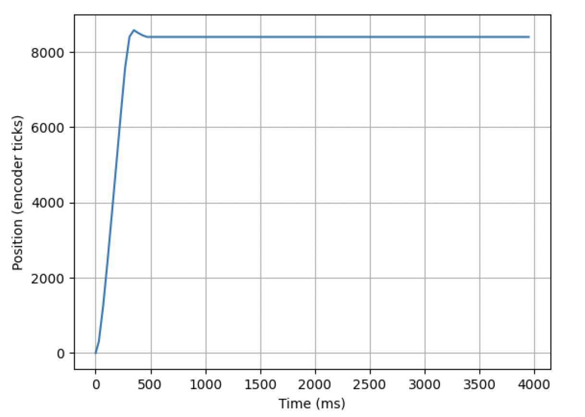

## ME 405 Lab 4

### Authors
By: Jack Krammer, Jason Chang

California Polytechnic State University

February 27, 2024

### Description
This lab was beneficial in increasing our understanding with multitasking with
a scheduler. First, we practiced scheduling the motor with the proportional 
controller set to have different periods between the successive task runs. In
effect, this correlated to actuating the motor at varying intervals and finding
the results. From this part, we learned that decreasing the interval between 
the proportional controller's run() function provided greater resolution and 
decreased error. However, there was not much noticable difference between these
tests as the period between the task execution was less than 20 milliseconds. 
Increasing this period allows the task scheduler to have more time to focus on 
other tasks. After some testing, it was found that the longest interval between
task executions that would provide consistently good results from the motor was
30 milliseconds. Plots illustrating these tests can be seen below. These plots
were a result of an adaptation of the GUI used in ME 405 Lab 3. Functionality
was added to increase user control over the tasks by including possibility for 
task period input. 

After these tests, the main.py file was altered such that two motors were run
at the same time using the task scheduler from the cotask and task_share 
imports.

### Hardware
The hardware provided in the ME 405 lab kit should be constructed to satisfy the 
following:

Motor 1 Pin Setup:
    PC1 = Enable Pin (internal with the L6206)
    PA0 = Motor Input 1 (internal with the L6206)
    PA1 = Motor Input 2 (internal with the L6206)

Encoder 1 Pin Setup:
    PC6 = Encoder Input A
    PC7 = Encoder Input B

Motor 2 Pin Setup:
    PA10 = Enable Pin (internal with the L6206)
    PB4  = Motor Input 1 (internal with the L6206)
    PB5  = Motor Input 2 (internal with the L6206)

Encoder 2 Pin Setup:
    PB6 = Encoder Input A
    PB7 = Encoder Input B

Motor wire connections:
    Blue	    Encoder channel B
    Yellow	    Encoder channel A
    Red	        Encoder 5V supply (should be connected to the 3.3V output)
    Black	    Encoder ground
    Orange	    Motor power (for the motor B + connection on the L6206)
    Green	    Motor power (for the motor B - connection on the L6206)
    (None)	    No connection

### Results
From these tests, we found that multitasking is beneficial as long as 
appropriate task intervals are utilized. For the motors included in the 
ME 405 lab kit, an interval of 30 milliseconds optimizes the possible time
for other tasks to rrun while ensuring the quality of operation for the 
current motor. 

For all the following step responses, a control gain of 0.05 was used on 
motors connected to flywheels. The GUI instructed the tasks to start and 
plotted the results. The closed-loop controller reads data from the motor 
encoder and actuates the DC motor from the provided ME 405 lab kit. 

When two motors were run at the same time, with the main.py file in this 
repository, there were no issues. Each motor went to its respective 
position.

Figure 1. Step responses illustrating the process of finding the optimal 
task execution period for the motor with the flywheel. From the bottom up:
the blue line is the step response when the task execution period is 10 ms;
the orange line corresponds to a period of 20 ms; the purple line a period
of 40 ms; the green line a period of 30 ms; and the red line a period of 35
ms. The purple line identifies 40 ms task period causing overshoot and 
oscillation.

Figure 2. Step response for the motor when a task execution period of 30 ms
is used. This was identified as the optimal period due to the lack of 
oscillation and a little faster that the slowest working rate for a factor 
of safety.

Figure 3. Step response for the motor when a task execution period of 40 ms
is used. This was identified as the first period that caused error and
overshoot in the step response. 

